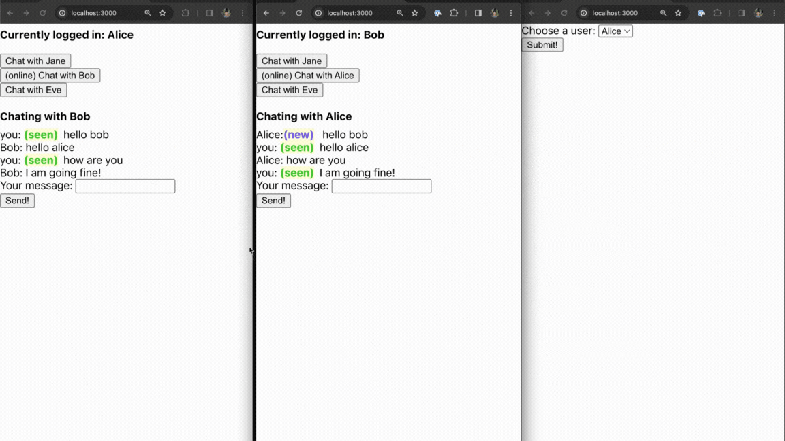

# Satchat

### Starting the application
Requirements:
```
java: 21
node: 20
docker
```

#### Spin up the database container and setup mock users
```bash
cd ./scripts
./docker.sh
```

#### Run the spring boot app
`cd` back to the project root
```bash
mvn clean install
java -jar ./target/satchat-0.0.1-SNAPSHOT.jar
```

#### Start the front end
Open a new terminal from the project root and run:
```bash
cd ./satchat-ui
npm install
npm run start
```
open localhost:3000

If you see an error like `Unexpected end of JSON input` that means you dont have any mock users in your database yet.

Set them up using the script `setup-users.sh`:
```bash
cd ./scripts
./setup-users.sh
```


